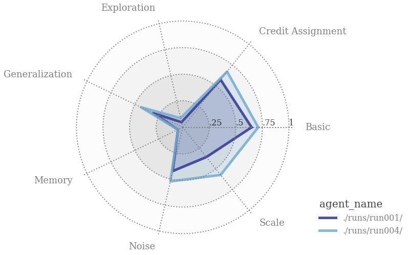

# Basic DQN
I've uploaded the code for the basic DQN agent and ran the BSuite experiments with different settings. I then used the analysis Jupyter Notebook from [the BSuite code repository](https://github.com/deepmind/bsuite) to compare the results.

The different settings were:

#### Run 1: Basic DQN

Settings:   
<em> qnet_settings = {"layers_sizes": [50], "batch_size": 64}

settings = {"batch_size": qnet_settings["batch_size"], "epsilon_start": 0.25, "epsilon_decay": 0.99,  
"epsilon_min": 0.03, "gamma": 0.99, "buffer_size": 200000, "lr": 5e-4,  
"qnet_settings": qnet_settings, "start_optimization": 64, "update_qnet_every": 4, "update_target_every": 10}</em>

#### Run 4: Basic DQN  
<em> qnet_settings = {"layers_sizes": [50], "batch_size": 64}

settings = {"batch_size": qnet_settings["batch_size"], "epsilon_start": 1.0, "epsilon_decay": 0.999,  
"epsilon_min": 0.025, "gamma": 0.99, "buffer_size": 200000, "lr": 1e-3,   
 "qnet_settings": qnet_settings, "start_optimization": 64, "update_qnet_every": 2, "update_target_every": 25}</em>

As you can probably infer from the names, I did run more experiments, but the results from these two sets are the best and worst performances I have achieved while tuning parameters in a non-systematic fashion.
The second set (Run 4) has somewhat more aggressive parameters, a higher learning rate, a larger initial epsilon for exploration and a lower epsilon decay rate. The update rate for the target network was decreased for the second network.

   
<em>Figure 1: Result of the DQN agent with two different parameter sets. This plot was made using the analysis notebook from the [Bsuite GitHub repository](https://github.com/deepmind/bsuite).</em>

As you can see, the second parameter set shows better results than the first set. However, they are both not as good as the results for DQN shown on the BSuite page. In the analysis Jupyter notebook, there are many plots describing the performance of the agent on each individual experiment; however, I first want to make progress on implementing the entire Rainbow agent. After that, I might consider diving into such detail and run a more thorough parameter search at a later time.
